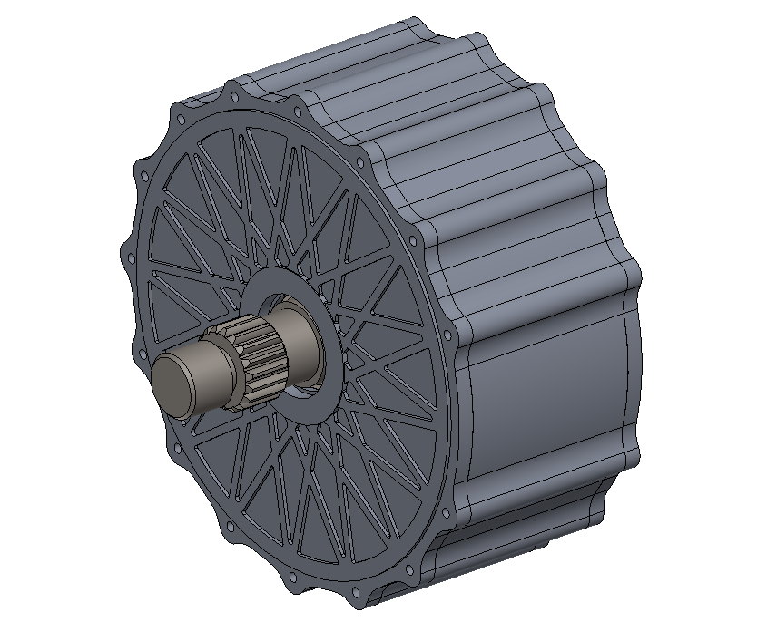
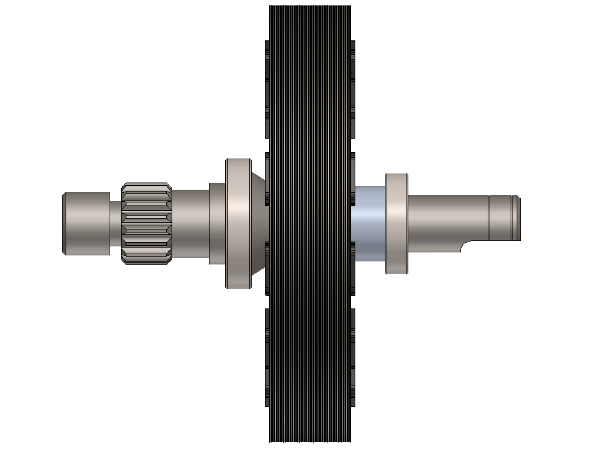
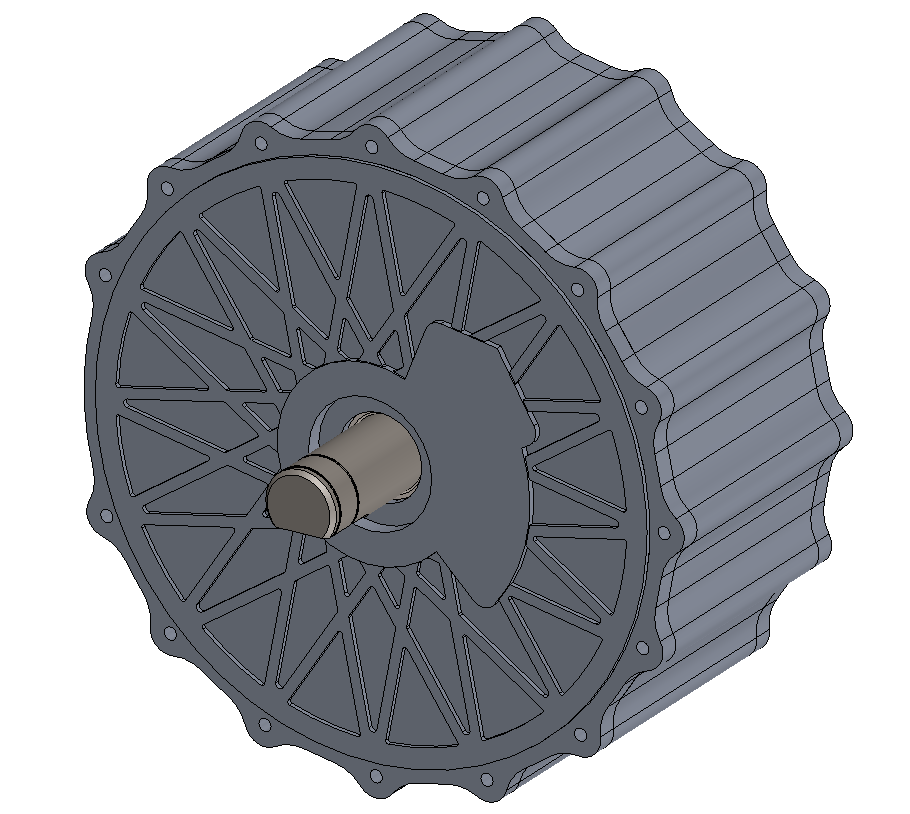

   

  
  
  

## Hello, I'm Ali Özkan (@aliozkanme) 👋
Welcome to my GitHub profile! 

I’m a passionate Electrical Engineer with 8+ years of R&D experience in power converter topologies and embedded control systems. My technical focus includes the electromagnetic design of electric motors, driver development, and TI 32-bit microcontroller applications. Currently pursuing M.Sc. studies specialized in Electric Motor and Drive systems, aiming to bridge practical industrial design with advanced theoretical modeling using MATLAB/Simulink and PSIM.

## My Work Areas - Let’s Collaborate On

---

### ⚙️ Electric Machine Designs

I am deeply interested in the electromagnetic design and optimization of advanced electric machines. My work focuses on Electric Machine R&D projects, where I implement high-efficiency motor topologies and develop advanced power electronics control strategies. I extensively use the Ansys Maxwell ecosystem for high-fidelity finite element analysis (FEA) to bridge the gap between electromagnetic theory and physical hardware performance.

**To explore my simulations and drawings featured my repository:**

### *:electric-machine-design:* [**Electric Machine Design Projects**](https://github.com/aliozkanme/Electric-Machine-Design-Projects)

Mechanical design, assembly, and thermal management of electric machines (PMSM, BLDC, Axial-Flux, SynRM) using SolidWorks.

### *:techstack:* Tools & Technologies

 

### *:demonstrations:* Project Showcases

---

### 🤖 Robotics & Autonomous Systems

I am deeply interested in the design and development of advanced robotic systems. My work focuses on Robotics R&D projects, where I implement autonomous navigation algorithms and develop multithreaded control architectures. I extensively use the ROS/Gazebo ecosystem for high-fidelity simulations to bridge the gap between software and physical hardware.

**To explore my simulations and control algorithms featured my repository:**

### *:robotics:* [**Robotics Research Projects**](https://github.com/aliozkanme/Robotics-Research-Projects)

A collection of advanced robotics R&D projects, autonomous navigation algorithms, and ROS/Gazebo simulations focusing on multithreaded control architectures.

### *:techstack:* Tools & Technologies

   

### *:demonstrations:* Project Showcases

---

### ⚡ Power Electronics

I am deeply interested in the design, modeling, and optimization of advanced power electronic systems. My work focuses on Power Electronics R&D projects, where I implement high-efficiency converter topologies and develop advanced switching control strategies. I extensively use simulation environments to perform high-fidelity analysis to bridge the gap between power electronics theory and physical hardware performance.

**To explore my simulations and control algorithms featured my repository:**

### *:power-electronics:* [**Matlab/Simulink Power Electronics Projects**](https://github.com/aliozkanme/Electric-Machine-Design-Projects)

Simulation projects for Power Electronics circuits using MATLAB/Simulink.

### *:techstack:* Tools & Technologies

    

### *:demonstrations:* Project Showcases

---

### 💻 Embedded Systems

I possess comprehensive experience in embedded system design, having actively worked with 8051 Assembly, 8-bit PIC, and 32-bit TI C2000 series microcontrollers. My technical expertise also extends to ARM architectures (16/32-bit), allowing me to develop robust real-time firmware and control solutions across various hardware platforms.

**To explore my source codes featured my repository:**

### *:assembly:* [**Embedded System Assembly 8051 Projects**](https://github.com/aliozkanme/Embedded-System-Assembly-8051-Projects)

This repository contains firmware developments and embedded system applications created that using the 8051 Instruction Set and Assembly language, primarily focused on Analog Devices ADuC841 microcontroller (MCUs) via Keil µVision.

### *:techstack:* Tools & Technologies

   

---

### 🛠️ Mechanical Design & Industrial Modeling

I am deeply interested in mechanical design and industrial product development. My work focuses on creating complex 3D parts (.sldprt) and assemblies, where I implement precise parametric modeling techniques for industrial applications. I extensively use SolidWorks to generate detailed technical drawings and render industrial concepts to bridge the gap between conceptual design and manufacturing ready products.

**To explore my drawings featured my repository:**

### *:solidworks:* [**SolidWorks Portfolio**](https://github.com/aliozkanme/SolidWorks-Portfolio)

A visual showcase of mechanical design projects using SolidWorks. Demonstrating proficiency in 3D modeling, assembly design, and manufacturing outputs (DXF/Drawings).

### *:techstack:* Tools & Technologies

    

### *:demonstrations:* Project Showcases

---

### 💻 Application Development & Utility Software

I am deeply interested in software architecture and application ecosystems. My work focuses on developing versatile utility tools and mobile applications, where I implement automation workflows and optimize development processes. I extensively use Python and cross-platform frameworks to build robust solutions that bridge the gap between complex tasks and user productivity.

**To explore my scripts featured my repository:**

### *:utility-scripts-python:* [**Python Utility Scripts**](https://github.com/aliozkanme/Python-Utility-Scripts)

A versatile collection of Python

### *:techstack:* Tools & Technologies

  

### *:demonstrations:* Project Showcases

---

### 🏭 Power Systems Analysis

I am deeply interested in the computational analysis and stability of modern power grids. My research focuses on power system dynamics, where I implement numerical integration algorithms and theoretical methods like the Equal Area Criterion (EAC) to model transient behavior under fault conditions. I extensively use MATLAB and Python to perform high-fidelity time-domain simulations, bridging the gap between mathematical modeling and grid protection coordination.

**To explore my simulations and control algorithms featured my repository:**

### *:power-systems:* [**Power Systems Analysis with Computer Aided**](https://github.com/aliozkanme/Power-Systems-Analysis-with-Computer-Aided)

A collection of computational projects and simulations focused on power system dynamics, stability, and control using Computer Aided

### *:techstack:* Tools & Technologies

 

### *:techpaper:* Technical Research & Working Papers

- **Topic:** *Transient Stability in Multi-Machine Power Systems*
- **Methodology:** Equal Area Criterion (EAC) & Time-Domain Simulation
- **Platform:** ResearchGate

---

## 📫 Connect with Me
 

---

 © 2026 @aliozkanme, all rights reserved.

<!--
**aliozkanme/aliozkanme** is a ✨ _special_ ✨ repository because its `README.md` (this file) appears on your GitHub profile.

Here are some ideas to get you started:

- 🔭 I’m currently working on ...
- 🌱 I’m currently learning ...
- 👯 I’m looking to collaborate on ...
- 🤔 I’m looking for help with ...
- 💬 Ask me about ...
- 📫 How to reach me: ...
- 😄 Pronouns: ...
- ⚡ Fun fact: ...
-->
